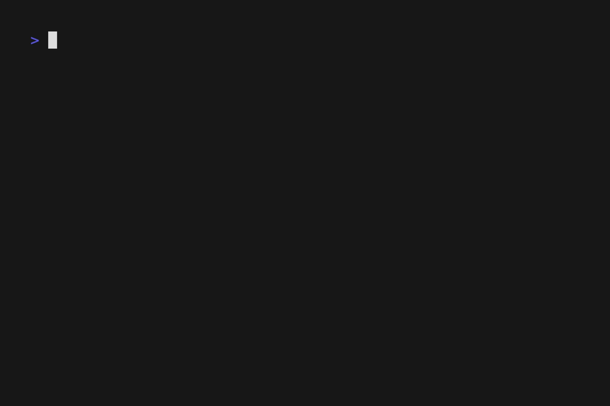

# pinpm

[](https://www.npmjs.com/package/pinpm)
[](https://github.com/koki-develop/pinpm/actions/workflows/release-please.yml)
[](./LICENSE)

Pin dependency versions in `package.json`.



## Installation

```console
$ npm install -g pinpm
```

## Usage

```console
$ pinpm --help
Usage: pinpm [options]

Pin dependency versions in package.json

Options:
  -V, --version              output the version number
  -l, --lockfile <lockfile>  lockfile to use
  -i, --install              run install command
  -h, --help                 display help for command
```

Supported package managers:

- [npm](https://docs.npmjs.com/cli/commands/npm) (`package-lock.json`)
- [pnpm](https://pnpm.io) (`pnpm-lock.yaml`)
- [bun](https://bun.sh/package-manager) (`bun.lock`, `bun.lockb`)

## LICENSE

[MIT](./LICENSE)
